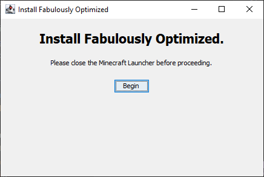
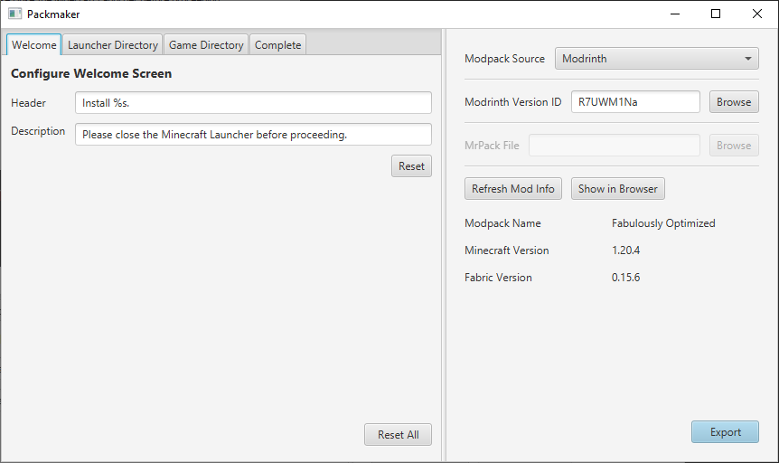

# Packmaker

Have you ever hosted a modded Minecraft server and wanted to invite friends, but gotten frustrated as you walk them through the process of installing mods, which is *somehow* too complex for them to understand? Well, fret no further, 'cause Packmaker's here!

(That's a catchy intro, right?)

Packmaker is a simple program that allows you to generate an automatic installer for any Fabric modpack. Simply import it into Packmaker and send your friends the generated executable, which will automate the process of installing the modpack, alongside Fabric and the right version of Minecraft. No more slamming your head into a desk as you explain why a 1.20.1 mod won't work in 1.20.2!

> The generated installer

## Usage

> The main window

The primary window of the app is split into two parts: the Config Editor (left) and the Modpack Viewer (right).

The config editor is rather straightforward: it allows you to customize the text that is displayed on each screen of the installer. The default text is satisfactory for most use-cases.

The Modpack Viewer is where you actually configure what will be installed.

There are two possible modpack sources: Modrinth and from a local file. If the source is set as a local file, you will be able to browse for a [Modpack](https://support.modrinth.com/en/articles/8802351-modrinth-modpack-format-mrpack) (.mrpack) file to use. This file will be packed into the generated installer and installed during execution.

If the source is set to Modrinth, a version id is required in the field marked "Modrinth Version ID." Unlike local files, Modrinth-based installers simply hold a pointer to the modpack, which will be downloaded at runtime.

If you're unsure where to find the version ID, click "Browse" and use the newly-opened window to locate the desired version.

> The version selection window

Once you're ready to export the installer, click the "Export" near the bottom. This will open the "export window", where you will select the target file and the export type.

> The export window

There are two available export types: "Windows Executable" and "Universal Jar".

As the name implies, Windows Executable will create a standalone executable file (.exe) that will run the installer natively on Windows systems. This is the most reliable if you know what operating system the user is running.

Universal Jar, on the other hand, will create an executable Jar file (.jar), which will work on any operating system where Minecraft runs. However, this requires Java to be installed on the user's system beforehand.

If you're unsure, it never hurts to export both.
